# RestAPI


> RestAPI documentada com swagger

Projeto feito em NodeJS junto do MySQL para o banco de dados que busca mostrar como funciona uma API com verbos HTTP GET, POST, PUT e DELETE e como documentá-la com o swagger

---

## Tecnologias

O projeto em questão utilizas as seguintes dependências e tecnologias: 

* 
* 
* 
* 
* 
* 
* 
* 
* 
* 
* 
* 

## Instalação

Clone o projeto em um repositório de sua escolha
```
git clone https://github.com/goldmansenai/restAPI
```

Acessa a pasta do projeto e instale as dependências
```
cd restAPI && npm install
```

Rode o projeto com o VsCode
```
code .
```

E em seguida abra o seu MySQL Workbench (caso não o tenha, você pode baixá-lo <a href="https://dev.mysql.com/downloads/workbench/
" target="_blank">aqui</a>) e crie seu esquema a partir das instruções abaixo

<p>Passo 1:</p>
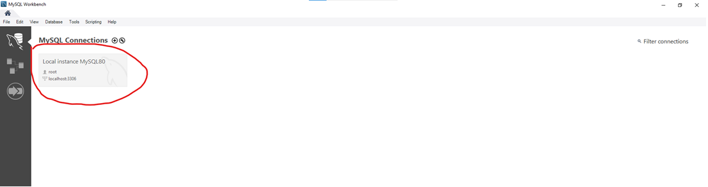
<p>Passo 2:</p>
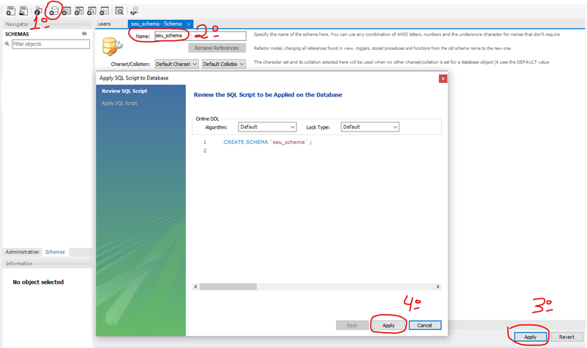
<p>Passo 3:</p>
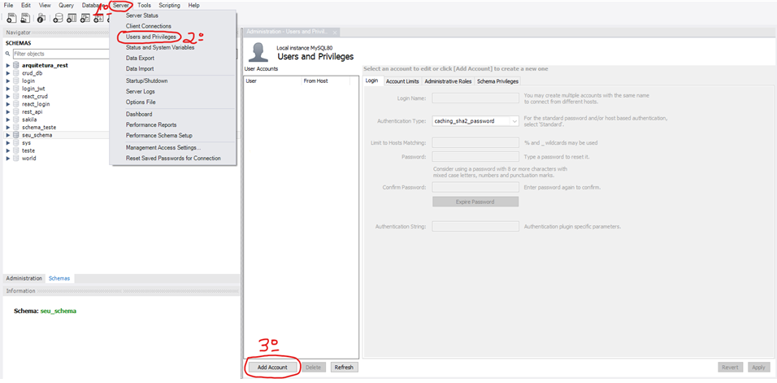
<p>Passo 4:</p>
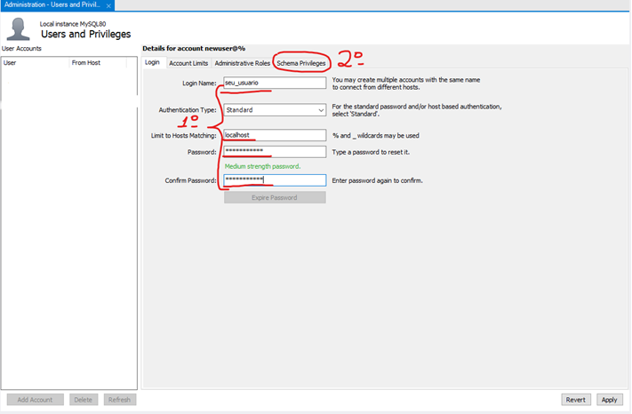
<p>Passo 5:</p>
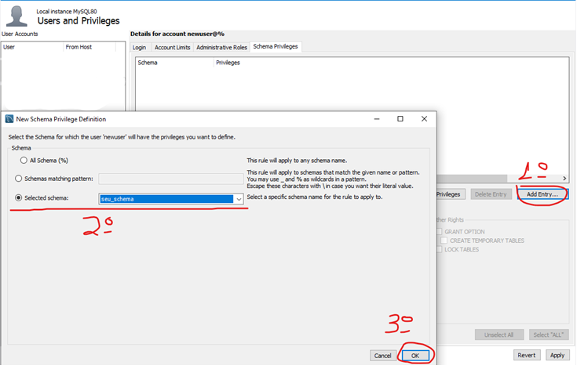
<p>Passo 6:</p>
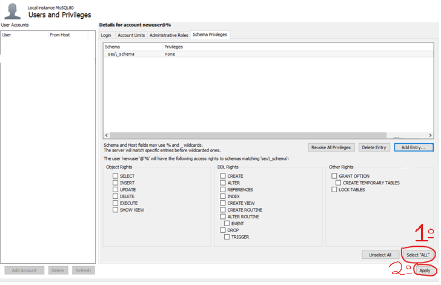

Com o banco conectado, no terminal (Ctrl + Shift + ') digite npm run start
```
npm run start
```

Assim que seu servidor estiver rodando, você pode ir em localhost:3001/api-docs

---

## Utilização
<p>Página Inicial:</p>
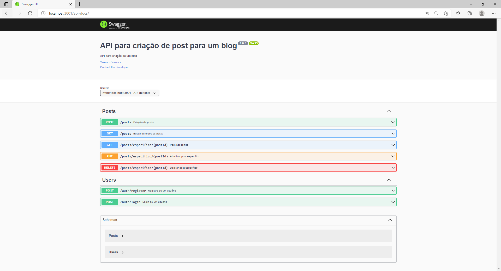
<p>Register:</p>
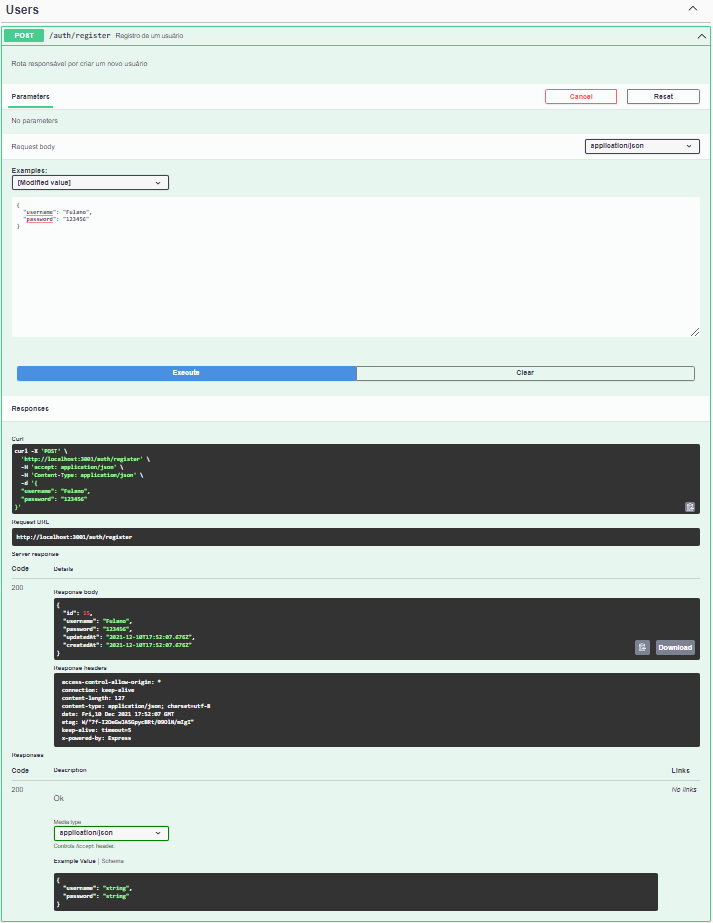
<p>Login:</p>
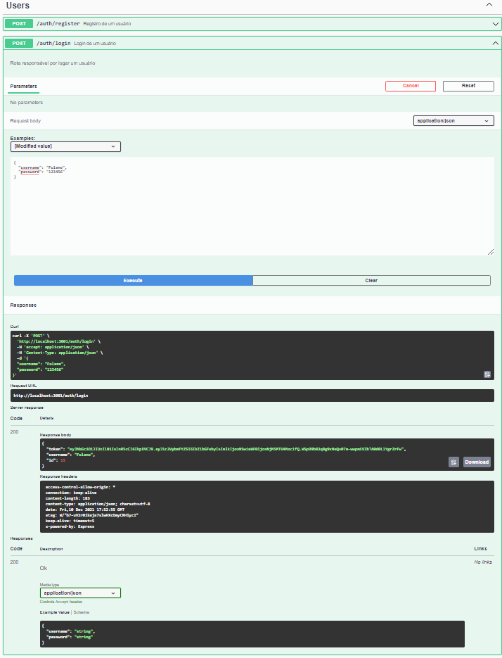
<p>GET:</p>
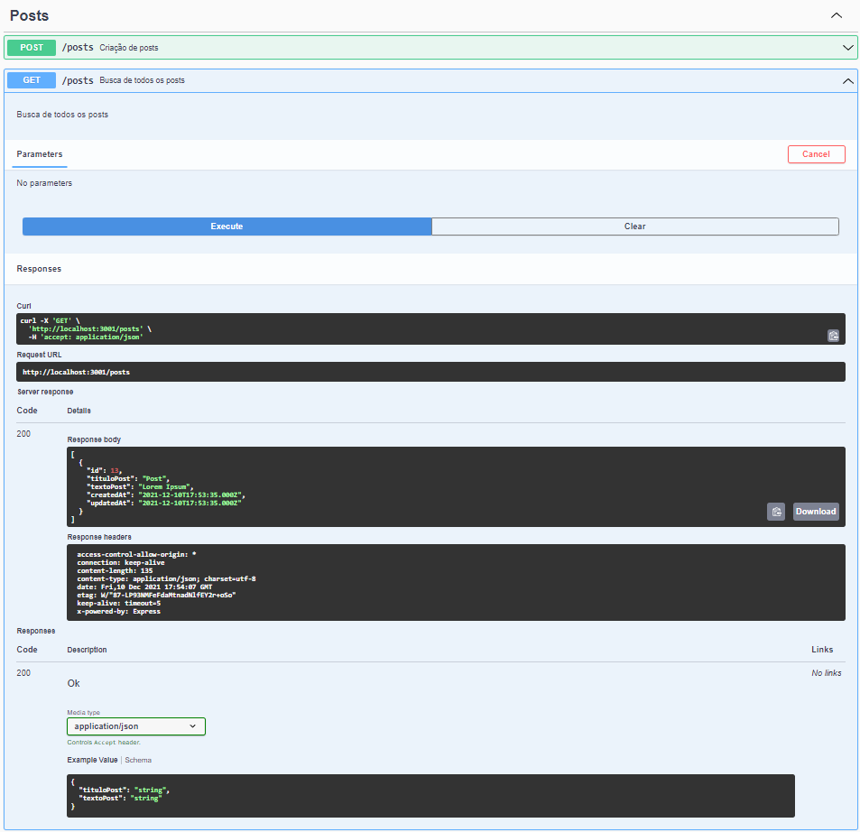
<p>GET (1 Post):</p>
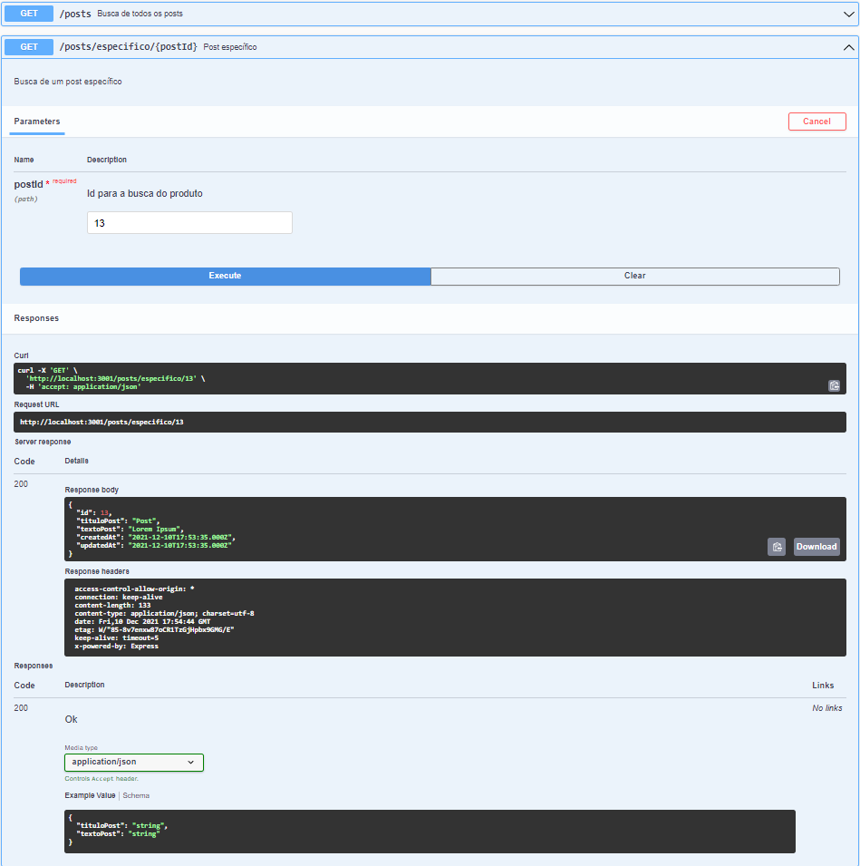
<p>POST:</p>
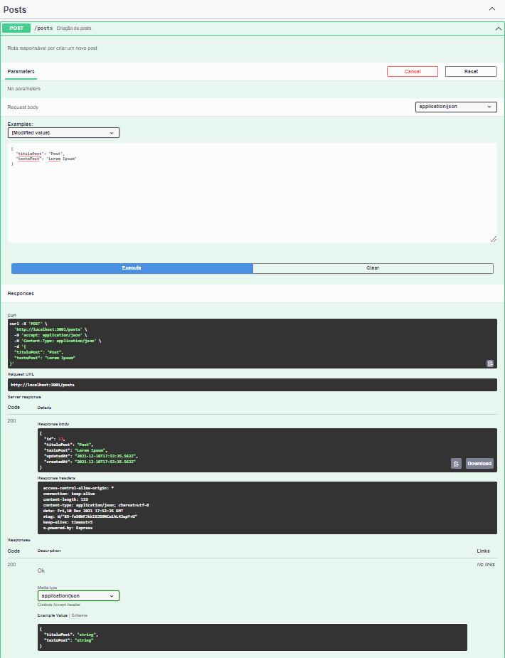
<p>PUT:</p>
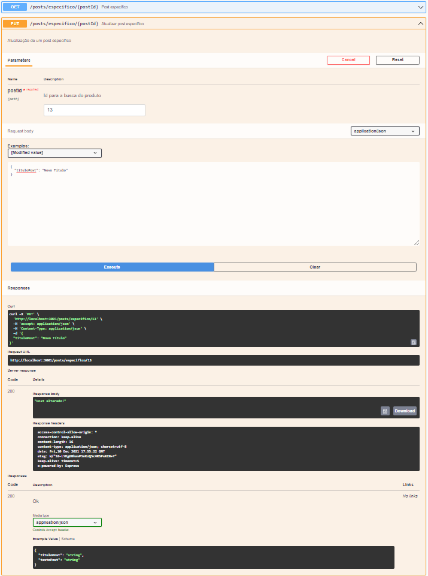
<p>DELETE:</p>
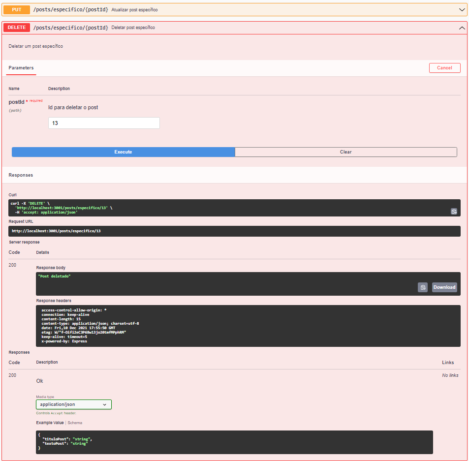
---

## Autores

* *Camili Martins*
* *Emelly Costa*
* *Patricia Soares*
* *Thiago Amorim*
* *Victor Gomes*
* *Vinícius Sanches*